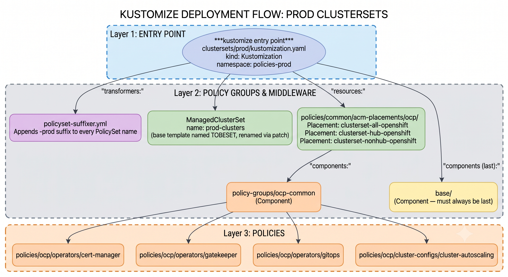
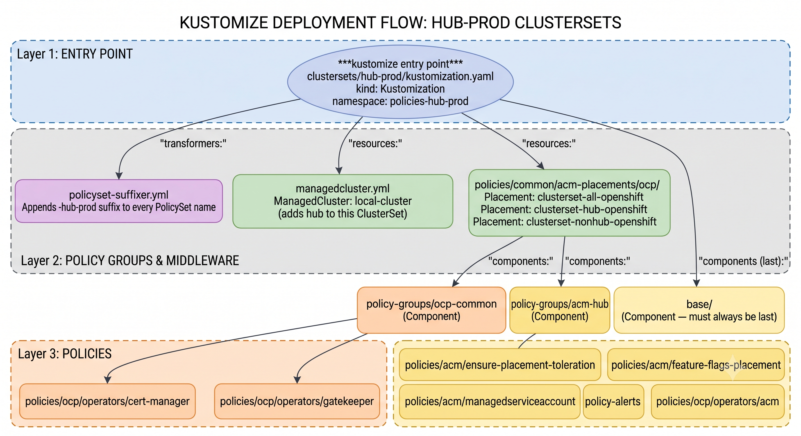
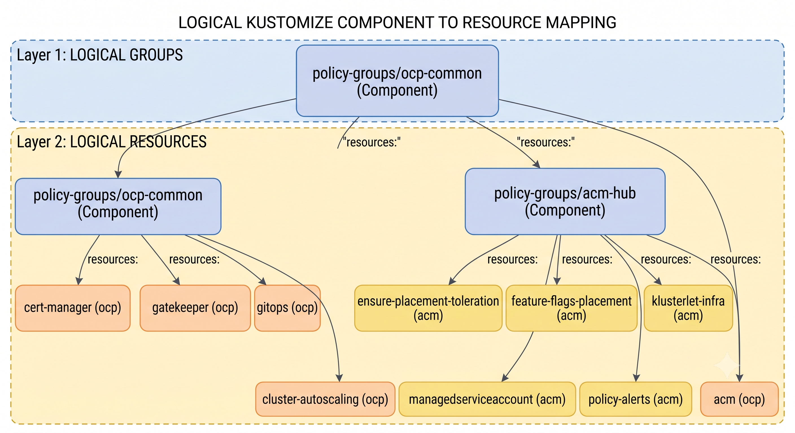
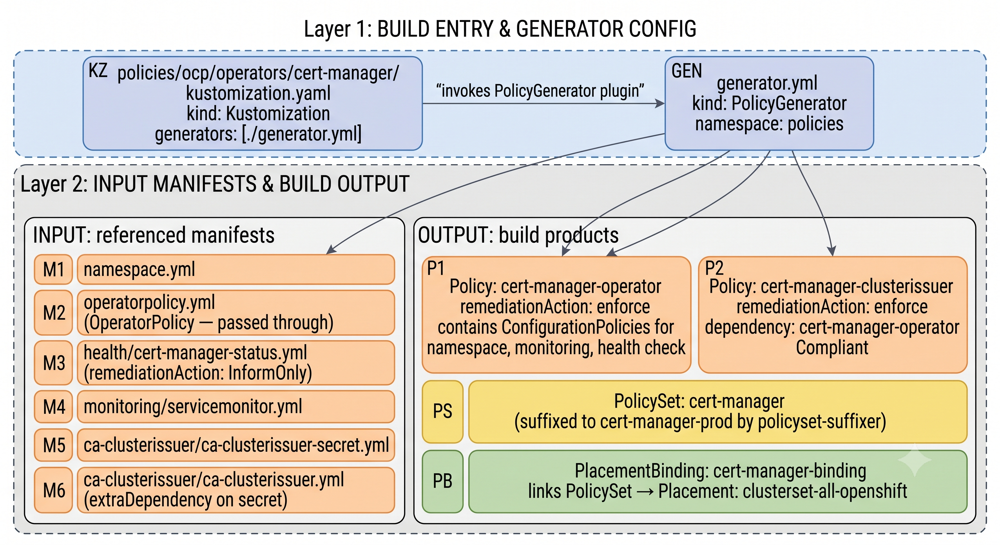
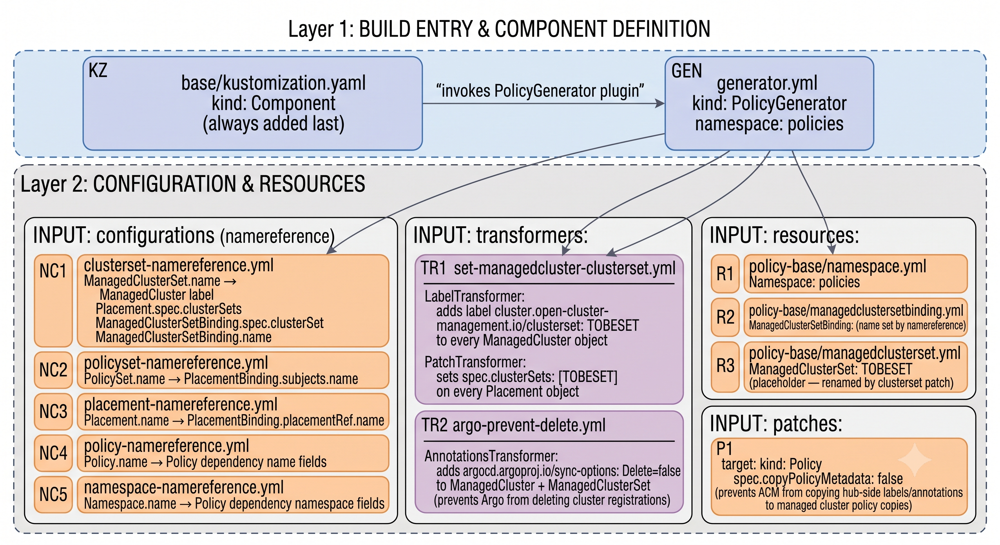
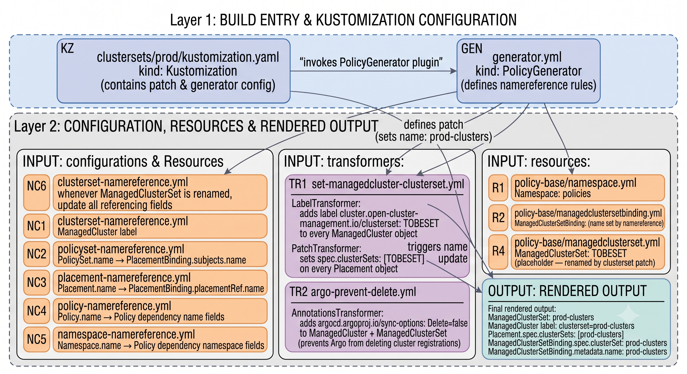
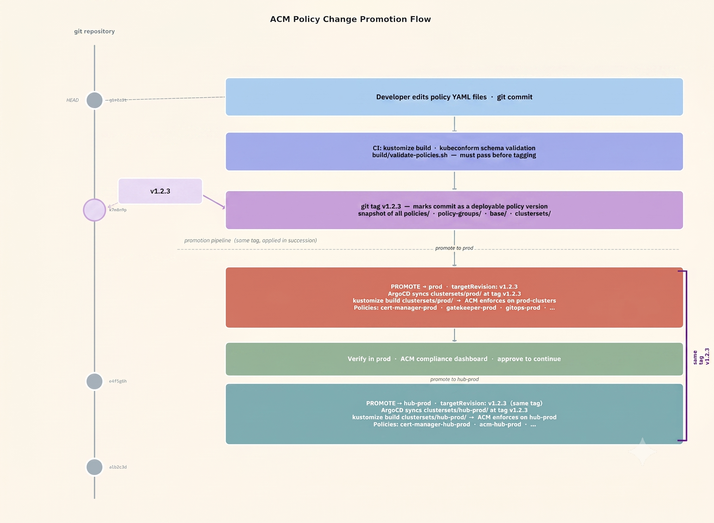

## Understanding how the kustomize documents are implemented

This document explains the four directory layers of this repository and how they combine during a `kustomize build` run to produce ACM `Policy`, `PolicySet`, `Placement`, and cluster-infrastructure objects.

1. [ClusterSets (entry point)](#clustersets)
2. [Policy Groups](#policy-groups)
3. [Individual Policy Directories](#individual-policy-directories)
4. [Base Component](#base-component)
5. [ClusterSet Name Propagation](#clusterset-name-propagation)
6. [Change Promotion Flow](#change-promotion-flow)

Within the diagrams below, blocks marked "***kustomize entry point***" represent the `kustomization.yaml` that is passed to the `kustomize build` command.

---

### ClusterSets

```
kustomize build clustersets/prod/
kustomize build clustersets/hub-prod/
```

Each directory under `clustersets/` is a **self-contained, environment-specific build root** (`kind: Kustomization`). Running `kustomize build` against one of these directories produces the complete set of ACM objects for that environment and applies them to the ACM hub.

**`clustersets/prod/` — non-hub production clusters**



**`clustersets/hub-prod/` — ACM hub cluster**

The hub-prod clusterset extends the prod pattern with two additions: a `ManagedCluster` resource for the local hub cluster and the `acm-hub` policy group.



The `namespace:` field in each clusterset's `kustomization.yaml` sets the target namespace for all `Policy`, `PolicySet`, `Placement`, and `PlacementBinding` objects generated by that build. **Every policy's `generator.yml` must set `namespace: policies`** (the base name without the environment suffix) — kustomize applies the namespace from the clusterset `kustomization.yaml` on top of it.

---

### Policy Groups

Policy groups are **reusable Kustomize Components** that bundle logically related policies. A clusterset includes one or more policy groups via the `components:` key. Adding a policy group to a second clusterset automatically includes all of its policies in that environment's build with no duplication.



Policy groups use `kind: Component` (not `kind: Kustomization`) so that kustomize processes them as reusable overlays rather than as standalone build roots. This also controls *when* the component's resources are merged into the object tree relative to `base/`.

---

### Individual Policy Directories

Each policy directory contains:
- **`kustomization.yaml`** (`kind: Kustomization`) — lists `generator.yml` under `generators:`
- **`generator.yml`** (`kind: PolicyGenerator`) — declares policies, manifests, remediation actions, dependencies, and the PolicySet
- **Raw manifest files** — the actual Kubernetes/OCP resources to be enforced on managed clusters

The ACM `PolicyGenerator` kustomize plugin reads `generator.yml` and wraps each manifest file in an ACM `ConfigurationPolicy` (or passes through `OperatorPolicy` objects), then groups them into named `Policy` objects. It also generates the `PolicySet` and `PlacementBinding` that link policies to a placement.



**Policy dependencies** declared in `generator.yml` enforce ordering: `cert-manager-clusterissuer` will not run until `cert-manager-operator` reaches `Compliant`. The namereference configurations in `base/` ensure dependency name fields are updated if kustomize renames the referenced policy.

**InformOnly manifests** (like `health/cert-manager-status.yml`) create read-only `ConfigurationPolicy` objects. These can be used as `extraDependencies` in other policies to gate on a real resource being ready before proceeding.

---

### Base Component

`base/` is a Kustomize Component that is **always included last** in every clusterset's `components:` list. It applies a set of transformers, namereference configurations, and patches globally across everything already in the object tree.



---

### ClusterSet Name Propagation

The most non-obvious aspect of this structure is how the `ManagedClusterSet` name (e.g. `prod-clusters`) automatically appears in `ManagedCluster` labels, `Placement.spec.clusterSets`, and `ManagedClusterSetBinding` without repeating it manually. This relies on kustomize's [namereference](https://kubectl.docs.kubernetes.io/references/kustomize/builtins/#namereference) feature.



**Step-by-step:**
1. `base/policy-base/managedclusterset.yml` defines a `ManagedClusterSet` with name `TOBESET` as a placeholder.
2. The base transformers initialize the `ManagedCluster` clusterset label and all `Placement.spec.clusterSets` values to `TOBESET`, creating references that kustomize can track.
3. The clusterset `kustomization.yaml` patches the `ManagedClusterSet` name to its real value (e.g. `prod-clusters`).
4. `clusterset-namereference.yml` instructs kustomize to propagate that rename to every field that references a `ManagedClusterSet` by name.
5. kustomize outputs all objects with the correct environment-specific name — no manual repetition required.

The same pattern applies to `PolicySet` names (via `policyset-namereference.yml`): the `-prod` or `-hub-prod` suffix applied by `policyset-suffixer.yml` is automatically reflected in the `PlacementBinding.subjects.name` field.

---

### Change Promotion Flow

Changes to ACM policies are controlled by **git tags**. Each tag represents a tested, deployable snapshot of the entire policy repository — all `policies/`, `policy-groups/`, `base/`, and `clustersets/` content at that commit. Promoting a change to an environment means updating that environment's ArgoCD `Application` to reference the new tag as its `targetRevision`. The same tag is applied to each clusterset in succession, allowing validation in one environment before advancing to the next.



**Step-by-step:**
1. Developer edits policy YAML files and commits to git.
2. CI runs `build/validate-policies.sh` — `kustomize build` and `kubeconform` schema validation must pass.
3. A git tag (e.g. `v1.2.3`) is created on the validated commit, marking it as a deployable policy version.
4. The `prod` clusterset's ArgoCD Application `targetRevision` is set to `v1.2.3`. ArgoCD syncs `clustersets/prod/` at that tag, kustomize renders the full policy set, and ACM enforces it on all clusters in `prod-clusters`.
5. Compliance is verified via the ACM dashboard. Once approved, promotion continues.
6. The `hub-prod` clusterset's ArgoCD Application `targetRevision` is updated to the **same tag** `v1.2.3`. The same process runs against `clustersets/hub-prod/`, enforcing policies on the ACM hub cluster.

Adding more environments (e.g. `dev`, `qa`) follows the same pattern — create a `clustersets/<env>/` directory and promote the tag through the sequence in the order that fits your release process.

---

### Build Commands

Render a single environment:

```bash
kustomize build --enable-alpha-plugins --load-restrictor LoadRestrictionsNone clustersets/prod/
kustomize build --enable-alpha-plugins --load-restrictor LoadRestrictionsNone clustersets/hub-prod/
```

The `--enable-alpha-plugins` flag is required for the ACM `PolicyGenerator` plugin. The `--load-restrictor LoadRestrictionsNone` flag allows the build to follow `../..` relative paths from within a clusterset directory into `policy-groups/`, `policies/`, and `base/`.
